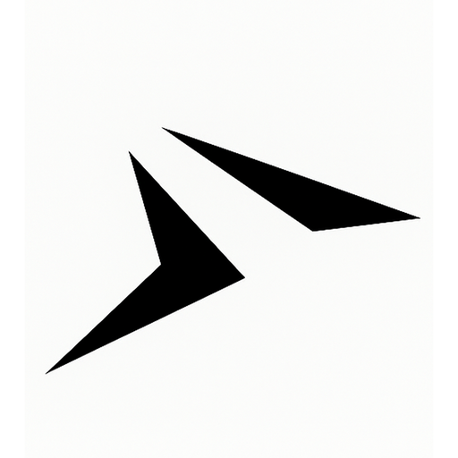

# fews-ios

> **Few** apps in **one** repository - iOS 앱 개발 모노레포

## 📱 앱 목록

|                                                            앱 아이콘                                                             |            앱 이름             |         부제목         |                   App Store                   |
| :------------------------------------------------------------------------------------------------------------------------------: | :----------------------------: | :--------------------: | :-------------------------------------------: |
|   |      **Toffs - 매매일지**      |      투자 관리 앱      | [다운로드](https://apps.apple.com/app/toffs)  |
|   |     **Plots - 독서 기록**      |  책, 영화, 문화 기록   | [다운로드](https://apps.apple.com/app/plots)  |
|  |     **Retros - 회고 일기**     | KPT로 체계적 성장 관리 | [다운로드](https://apps.apple.com/app/retros) |
|  |    **Multis - 투두 타이머**    |   멀티 타이머 생산성   | [다운로드](https://apps.apple.com/app/multis) |
|   | **Capts - 사진 텍스트 변환기** |     AI 스마트 OCR      | [다운로드](https://apps.apple.com/app/capts)  |

## 🏗️ 모노레포 아키텍처

이 저장소는 **모노레포(Monorepo)** 패턴을 채택하여 여러 iOS 앱을 하나의 저장소에서 관리합니다.

### 왜 모노레포인가?

**장점:**

- 📦 **코드 공유**: 공통 모듈과 컴포넌트를 여러 앱에서 재사용
- 🔄 **일관성**: 동일한 개발 도구, 컨벤션, CI/CD 파이프라인 적용
- 🚀 **효율성**: 한 번의 수정으로 모든 앱에 공통 기능 배포
- 🎯 **관리 편의성**: 하나의 저장소에서 모든 프로젝트 관리

**구조:**

```
fews-ios/
├── Apps/                 # 각 앱별 타겟
│   ├── Capts/           # OCR 앱
│   ├── Retros/          # 회고 일기 앱
│   ├── Multis/          # 타이머 앱
│   ├── Plots/           # 독서 기록 앱
│   └── Toffs/           # 투자 관리 앱
├── Modules/             # 공유 모듈
│   ├── CommonFeature/   # 공통 기능
│   └── DS/              # 디자인 시스템
├── fastlane/            # 자동화 배포
└── Tuist/               # 프로젝트 관리
```

### 기술 스택

- **프로젝트 관리**: Tuist
- **아키텍처**: TCA (The Composable Architecture)
- **데이터**: SwiftData
- **UI**: SwiftUI
- **배포**: Fastlane
- **언어**: Swift 5.9+

---

_개인 개발자의 생산성 향상을 위한 도구들을 하나의 생태계로 구축합니다._
